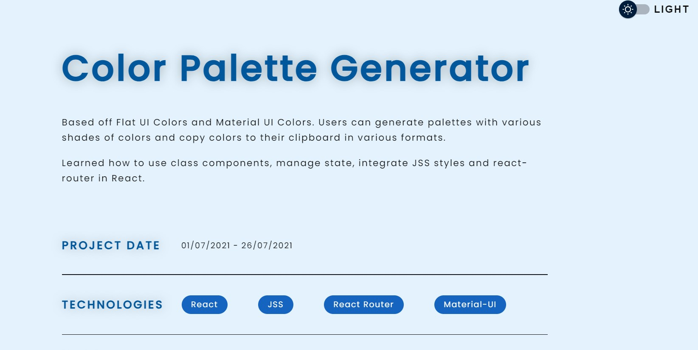

## Personal Portfolio Website

<b>Built with</b> 

-  A responsive frontend portfolio website made using Create React App(CRA)
- Used various React libraries such as Material UI, React Transition Group, etc.

<h2><a href="https://anushkabahuguna.github.io/portfolio-website/">Demo</a></h2>

